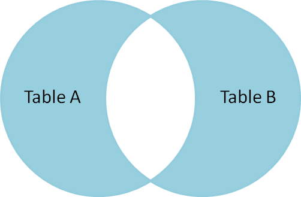

# SQL - Learning and Practice

This repository contains notes and queries with SQL. The purpose of this repository is to learn and practice PostgreSQL.

<!-- Table of contents -->
## Table of Contents

- [Cheat Sheet](#cheat-sheet)
- [SQL Statement Fundamentals](#sql-statement-fundamentals)
    * [SELECT](#select)
    * [COUNT](#count)
    * [SELECT WHERE](#select-where)
    * [ORDER BY](#order-by)
    * [LIMIT](#limit)
    * [BETWEEN](#between)
    * [IN](#in)
    * [LIKE AND ILIKE](#like-and-ilike)
- [GROUP BY - Statements](#group-by---statements)
    * [Aggregation Functions](#aggregation-functions)
    * [GROUP BY Function](#group-by-function)
    * [HAVING Function](#having-function)
- [JOINS](#joins)
    * [AS](#as)
    * [INNER JOIN](#inner-join)
    * [OUTER JOIN](#outer-join)
    * [FULL JOIN](#full-join)
    * [UNION](#union)
- [Advanced SQL Commands](#advanced-sql-commands)
    * [Timestamps and EXTRACT](#timestamps-and-extract)
    * [EXTRACT, AGE, TO_CHAR Functions](#extract-age-to-char-functions)
    * [SUBQUERY](#subquery)
    * [SELF JOIN](#self-join)


- [Creating Databases & Tables](#creating-databases--tables)
    * [Data Types](#data-types)
    * [Primary and Foreign Keys](#primary-and-foreign-keys)
    * [PRIMARY KEY](#primary-key)
    * [FOREIGN KEY](#foreign-key)
    * [Constraints](#constraints)
    * [Column Constraints](#column-constraints)
    * [Table Constraints](#table-constraints)
    * [CREATE Tables](#create-tables)
    * [INSERT Command](#insert-command)
    * [UPDATE](#update)
    * [DELETE](#delete)
    * [ALTER Table](#alter-table)
    * [DROP Table](#drop-table)
    * [CHECK Constraint](#check-constraint)
    
- [Conditional Expressions and Procedures](#conditional-expressions-and-procedures)
    * [CASE](#case)
    * [COALESCE](#coalesce)
    * [CAST](#cast)
    * [NULLIF](#nullif)
    * [VIEWS](#views)


## Cheat Sheet


# SQL Statement Fundamentals

## SELECT

```sql
-- Select a column from table
SELECT column_name FROM table_name;

-- Select more columns from table
SELECT column_name1, column_name1 FROM table_name;

-- Select all columns from table
SELECT * FROM table_name;

-- Select Distinct - i.e.: only select the distinct values from a column
SELECT DISTINCT(column_name) FROM table_name;
```

## COUNT

```sql
-- Count rows in column
SELECT COUNT(column_name/choice/*) FROM table_name;

-- Count distinct
SELECT COUNT(DISTINCT column_name) FROM talbe_name;
```

## SELECT WHERE

```sql
SELECT column1, column2
FROM table_name
WHERE conditions;
```

| Operator | Description |
| --- | --- |
| = | Equal |
| > | Greater than |
| < | Less than |
| >= | Greater than or equal to |
| <= | Less than or equal to |
| <> or != | Not equal to |

**************************************Logical Operations:**************************************

- AND
- OR
- NOT

```sql
-- Example SELECT WHERE
SELECT title FROM film
WHERE rental_rate > 4 AND replacement_cost >= 19.99
AND rating = 'R';
```

## ORDER BY

```sql
-- Order by a column Ascending or Descending
SELECT column_1, column_2
FROM table_name
ORDER BY column_1 ASC/DESC;

-- More than one orderings
SELECT column_1, column_2
FROM table_name
ORDER BY column_1 DESC, column_2 ASC;
```

## LIMIT

```sql
-- LIMIT Statement limits the number of rows shown by the query - like top5
SELECT column_1, column_2
FROM table_name
ORDER BY column_1 ASC/DESC 
LIMIT 5;
```

## BETWEEN

```sql
-- Using Between for numerical values 
SELECT *
FROM table_name
WHERE amount BETWEEN 8 AND 9;

-- Using the between with NOT logical statement
SELECT *
FROM table_name
WHERE amount NOT BETWEEN 8 AND 9;

-- Using Between for data values
SELECT *
FROM table_name
WHERE amount BETWEEN '2010-02-1' AND '2010-02-15';
```

## IN

```sql
-- Example of NOT IN sting values
SELECT color_name
FROM table_name
WHERE color_name IN ('red','blue') 

-- Example of IN numerical values
SELECT COUNT(*)
FROM table_name
WHERE amount IN (0.99,1.98,1.99)
```

## LIKE AND ILIKE

```sql
-- First letter example with LIKE - ! Is case sensitive
SELECT COUNT(*)
FROM customer
WHERE first_name LIKE 'J%' AND last_name LIKE 'S%'

-- ILIKE - is case insensitive - doesn't matter if you are using captital letter
SELECT COUNT(*)
FROM customer
WHERE first_name ILIKE 'j%' AND last_name ILIKE 's%'

-- Other example
SELECT COUNT(*)
FROM customer
WHERE first_name ILIKE 'er%'
```

# GROUP BY - Statements

## Aggregation Functions

- The main idea behind an aggregate function is to take multiple inputs and return single output.
- Most common aggregate functions: AVG(), COUNT(), MAX(), MIN(), SUM()
- Extra tip: ROUND(AVG(col_name), num_decimal_places)

```sql
-- Example using aggregation Functions. E.g.: returns the Minimum cost.
-- Similarly for MAX, AVG -- This will return a single value!
SELECT MIN(cost) FROM table_name;
```

## GROUP BY Function

- GROUP BY allows us to aggregate columns per some category.
- We need one categorical column to perform the GROUP BY (can be also numerical as catecories,  e.g. category = 1 , 2 ,3 , etc.)
- Example: we can grouby and sum per category and see the total sum of every category.

```sql
-- Basic Syntax -- Where AGG = Aggregation Function (SUM, MIN, MAX,...)
SELECT category_col, AGG(data_col)
FROM table 
GROUP BY category_col
```

- The GROUP BY clause must apper right after a FROM or WHERE statement!

```sql
-- Example with sales:
SELECT company, division, SUM(sales)
FROM finance_table
GROUP BY company, division
```

- WHERE statements should not refer to the aggregation results, later on we will leran to use HAVING statement to filter on those results.

## HAVING Function

- Is coming after a GROUP BY call.

```sql
-- Basic Syntax
SELECT company, SUM(sales)
FROM finance_table
WHERE company != 'Google'
GROUP BY company
HAVING SUM(sales)>1000
```

# JOINS
- JOINS allows us to combine data from different tables
- AS next to column allows us to rename columns.
- Join types are INNER JOINS, OUTER JOINS, FULL JOINS, UNIONS

## AS

```sql
-- Example: rename column with AS
SELECT SUM(amount) AS sum_amount
FROM PAYMENT;
```

## INNER JOIN


- **An INNER JOIN will result with the set of records that match in both tables.**
- INNER JOIN is symmetrical

```sql
-- Basic Syntax
SELECT * FROM TableA
INNER JOIN TableB
ON TableA.col_match = TableB.col_match
```

## FULL OUTER JOINs

- There are few different types of OUTER JOINs
- They will allow us to specify how to deal with values only present in one of the tables being joined.

### FULL OUTER JOIN


1. The FULL OUTER JOIN grabs everything in both tables
2. If values from the one table are not present in the second then the table will have null values.

```sql
-- Basic Syntax
SELECT * FROM TableA
FULL OUTER JOIN TableB
ON TableA.col_match = TableB.col_match 
```

### FULL OUTER JOIN with WHERE



1. Grab all the unique rows from tables
2. This is the opposite of INNER JOIN

```sql
SELECT * FROM TableA
FULL OUTER JOIN TableB
ON TableA.col_match = TableB.col_match 
WHERE TableA.id IS null OR TableB.id IS NULL
```

## LEFT OUTER JOIN


- A LEFT OUTER JOIN results in the set of records that are in the left table, if there is no match with the right table, the results are null.
- It is the same using LEFT JOIN  and LEFT OUTER JOIN
- The order of tables MATTER!!!

```sql
-- Basic Syntax
SELECT * FROM TableA
LEFT OUTER JOIN TableB
ON TableA.col_match = TableB.col_match
```

### LEFT OUTER JOIN with WHERE


- If we want entries unique to table A. Those rows found in TableA and not found in TableB.

```sql
SELECT * FROM TableA
LEFT OUTER JOIN TableB
ON TableA.col_match = TableB.col_mathc
WHERE TableB.id IS NULL
```

## RIGHT JOINS

- A RIGHT JOIN is essentially the same as a LEFT JOIN, except the tables are switched.
- This would be the same as switching the table order in a LEFT OUTER JOIN.

## UNION

- The UNION operator is used combine the results-set of two or more SELECT statements.
- It basically serves to directly concatenate two results together, essentially “pasting” them together.

```sql
-- Basic Syntax -- Columns need to match in both tables.
SELECT column_name(s) FROM table1
UNION
SELECT column_name(s) FROM table2
```

# Advanced SQL Commands

## Timestamps and EXTRACT

| TIME | Contains only time |
| --- | --- |
| DATE | Contains only date |
| TIMESTAMP | Contains only time and date |
| TIMESTAMPTZ | Contains only time, date and timezone |
- Careful considerations should be made when designing a table and database and choosing a time data type.
- Depending on the situation you may or may not need the full level of TIMESTAMPTZ
- Remember, you can always remove historical information, but you can’t add it!

### Functions and operations related to these specific data types:

- TIMEZONE - SELECT TIMEZONE()
- NOW - SELECT NOW()
- TIMEOFDAY - SELECT TIMEOFDAY()
- CURRENT_TIME - SELECT CURRENT_TIME()
- CURRENT_DATE - SELECT CURRENT_DATE()

## EXTRACT, AGE, TO_CHAR Functions

### EXTRACT

- Allows to extract or obtain a sub-component of a date value

```sql
-- Usage
EXTRACT(YEAR FROM date_col)

-- Calculates and returns the current age given a timestamp
AGE(date_col)

-- General function to convert data types to text
TO_CHAR(date_col, 'mm-dd-yyyy')
```

### SUBQUERY

- A sub query allows you to construct complex queries, essentially performing a query oooon the results of another query.
- The syntax is straightforward and invlolves two SELECTED statements.

```sql
-- Example of a Sub-Query
SELECT student, grade
FROM test_scores
WHERE grade > (SELECT AVG(grade) FROM test_scores)
```

### SELF-JOIN

- A self-join is a query in which a table is joined to itself
- Self-joins are useful for comapring values in a column of rows within the same table.
- It can be viewed as a join of two copies of the same table
- The table is not actually copied, but SQL performs the command as though it were.
- There is no special keyword for a self join, its simply standard JOIN syntax wuth the same table in both parts.
- BE CAREFUL: you should use an alias for the table.

```sql
-- Basic Syntax
SELECT tableA.col, tableB.col
FROM table as tableA
JOIN table as tableB
tableA.some_col = tableB.other_col
```


# Creating Databases & Tables

## Data Types

| DataType | Description |
| --- | --- |
| Boolean  | True of False |
| Character | char, varchar, text |
| Numeric | integer, float |
| Temporal | date, time, timestamp and interval |
| UUID | Universally Unique Identifiers |
| Array | Stores an array of stings, numbers, etc. |
| JSON | Json format data |
| Hstore key | value pair |
| Special Types | network address, geometric data, etc. |

Documentation of Data Types: [postgresql.org/docs/current/datatype.html](http://postgresql.org/docs/current/datatype.html)

## Primary and Foreign Keys

- Primary and Foreign keys typically make good column choices for joining together two or more tables.
- When creating tables and defining columns, we can use constraints to define columns as being a primary key, or attaching a foreign key relationship to another table.

### PRIMARY KEY

- A primary key is a column or a group of column or a group of columns used to udentify a row uniquely in a table.
- Primary keys are also important since they allow us to easily discern what columns should be used for joining tables together.
- Unique integer, NOT-NULL

### FOREIGN KEY

- A foreign key is a field or group of fields in a table that uniquely identifies a row in a another table.
- A foreign key is defined in a table that references to the primary key of the other table.
- The table that contains the foreign key is called referencing table or child table.
- The table to which the foreign key references is called referenced table or parent table.
- A table can have mulptiple foreign keys depending on its relationships with other tables.

## Constraints

- Constraints are the rules enforced on data columns on table.
- These are used to prevent invalid data from being entered into the database. This ensures the accuracy and reliability of the data in the database.

### Constraints Categories

- Column Constraints
    - Constraints the data in a column to adhere to certain conditions.
- Table Constraints
    - applied to the entire table rather than to an individual column.

### Column **constraints:**

| Constraint | Description |
| --- | --- |
| NOT NULL | Ensures that a column cannot have NULL value. |
| UNIQUE | Ensures that all values in a column are different. |
| PRIMARY Key | Uniquely identifies each row/record in a database table. |
| FOREIGN Key | Constraints data based on columns in other tables. |
| CHECK | Ensures that all values in a column satisfy certain conditions. |
| EXCLUSION | Ensures that if any two rows are compared on the specified operator, not all of these comparisons will return TRUE |

### Table **constraints:**

| Constraint | Description |
| --- | --- |
| CHECK (Condition) | To check a condition when insterting or updating data |
| REFERENCES | To constrain the value stored in the column that must exist in a column in another table. |
| UNIQUE (Column list) | forces the values stored in the columns listed inside the parentheses to be unique. |
| PRIMARY Key (Column list) | Allows you to define the primary key that consists of multiple columns. |

## CREATE Tables

```sql
-- Full General Syntax
CREATE TABLE table_name(
	column_name TYPE column_constraint,
	column_name TYPE column_constraint,
	table_constraint table_constraint,
) INHERITS existing_table_name;
```

```sql
-- Example creating a simple table
CREATE TABLE account(
	user_id SERIAL PRIMARY KEY, -- SERIAL creates the integer id
	username VARCHAR(50) UNIQUE NOT NULL,
	password VARCHAR(50) NOT NULL,
	email VARCHAR(250) UNIQUE NOT NULL,
	create_on TIMESTAMP NOT NULL, 
	last_login TIMESTAMP
) INHERITS account;
```

- Create more tables and link them:

```sql
-- Create table and link it with other tables in your database
-- You should not use SERIAL - Use INTEGER instead
CREATE TABLE account_job(
	user_id INTEGER REFERENCES account(used_id), -- Foreign key reference from account table
	job_id INTEGER REFERENCES jobs(job_id) -- Foreign Key
)
```

## INSERT Command

- Allows to add in rows to a table

```sql
-- Basic Syntax
INSERT INTO table(column1, column2,...)
VALUES
	(value1, value2, ...),
	(value1, value2, ...),...;

-- Basic Syntax with SELECT
INSERT INTO table(column1, column2,...)
SELECT column1, column2,...
FROM another_table
WHERE condition;
```

## UPDATE

- The UPDATE keyword allows for the changing of values of the columns in a table.

```sql
-- General Syntax
UPDATE table
SET column1 = value1,
	column2 = value2,...
WHERE
	condition;

-- Return affected rows:
UPDATE account
SET last_login = created_on
RETURNING account_id, last_login
```

## DELETE

```sql
-- We can use the DELETE clause to remove rows from a table:
DELETE FROM table
WHERE row_id = 1

-- We can delete rows based on their presence in other tables:
DELETE FROM tableA
USING tableB
WHERE tableA.id = tableB.id

-- DELETE all rows from a table: 
DELETE FROM table
```

## ALTER Table

- Allows for changes to an existing table structure, such as:
    - Adding, dropping, or renaming columns
    - Changing a column’s data type
    - Set DEFAULT values for a column
    - Add CHECK constraints
    - Rename table

```sql
-- Adding Columns
ALTER TABLE table_name
ADD COLUMN new_col TYPE

-- Remove Columns
ALTER TABLE table_name
DROP COLUMN new_col

-- Alter Constraints
ALTER TABLE table_name
ALTER COLUMN col_name
SET DEFAULT value / DROP DEFAULT / SET NOT NULL / DROP NOT NULL / ADD CONSTRAINT constraint
```

## DROP Table

- Complete removal of a column in a table.
- In PostgreSQL this will also automatically remove all of its indexes and constraints involving the column
- However, it will not remove columns used in views, triggers, or stored procedures without the additional CASCADE clause.

```sql
-- Drop a column
ALTER TABLE table_name
DROP COLUMN col_name

-- To remove all these dependencies
ALTER TABLE table_name
DROP COLUMN col_name CASCADE

-- Check for existence to avoid error
ALTER TABLE table_name
DROP COLUMN IF EXISTS col_name

-- Drop muplitple column
ALTER TABLE table_name
DROP COLUMN col_name1
DROP COLUMN col_name2
DROP COLUMN col_name3
. . .
```

## CHECK Constraint

- The CHECK constraint allows us to create more customized constraints that adhere to a certain condition.
- Such as making sure all inserted integer values fall below a certain threshold.

```sql
-- General Systax
CREATE TABLE example(
	ex_id SERIAL PRIMARY KEY, 
	age SMALLINT CHECK (age>21),
	parent_age SMALLINT CHECK (parent_age>age)
);
```

# Conditional Expressions and Procedures
## CASE

- We can use the CASE statement to only execute SQL code when certain conditions are met.
- This is very similar to IF/ELSE statements in other programming languages.
- There are two main ways to use a CASE statement, either a general CASE or a CASE expression.
- Both methods can lead to the same results.

```sql
-- General Systax
CASE
	WHEN condition1 THEN result1
	WHEN condition2 THEN result2
	ELSE some_other_result
END

-- A more complete example:
SELECT a
CASE WHEN a = 1 THEN 'one'
		 WHEN a = 2 THEN 'two'
ELSE 'other'
END 
FROM test;
```

## COALESCE

- The COALESCE function accepts an unlimited number of arguments. It returns the first argument that is not null. If all arguments are null, the COALENCE function will return null.
    - COALENCE(arg_1, arg_2,…,arg_n)
    
    ```sql
    -- Example:
    SELECT COALENCE(1,2)
    >> 1
    -- 
    SELECT COALENCE(NULL, 2, 3)
    >> 2
    ```
    
- The COALESCE function becomes useful when querying a table that contains null values and substituting it with another value.
- HINT: Keep the COALESCE function in mind in case you encounter a table with null values that you want to perform operations on!

## CAST

- The CAST operator let’s you convert from one data type into another.
- Keep in mind not every instance of a data type can be CAST data type, it must be reasonable to convert the data, for example ‘5’ to an integer will work, ‘five’ to an integer will not.

```sql
-- Example Syntax for CAST
SELECT CAST('5' AS INTEGER)

-- PostgreSQL CAST operator
SELECT '5'::INTEGER

-- Usage inside a SELECT Query
SELECT CAST(data AS TIMESTAMP)
FROM table_1
```

## NULLIF

- The NULLIF function takes in 2 inputs and returns NULL if both are equal, otherwise it will returns the first argument passed.
    
    ```sql
    -- Syntax:
    NULLIF(arg1, arg2)
    
    -- Example:
    NULLIF(10,12)
    >> Return 10
    ```
    

## VIEWS

- Often there are specific combinations of table and conditions that you find yourself using quite often for a project.
- Instead of having to perform the same query and over again as a starting point, you can create a VIEW to quickly see this query with a simple call.
- A VIEW is a database object that is of a stored query.
- A view can be accessed as a virtual table in PostgreSQL.
- Notice that a view does not store data physically, it simply sotres the query.