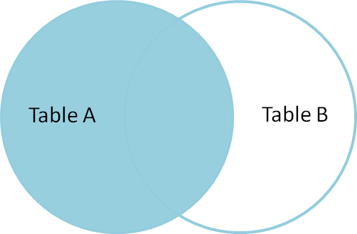
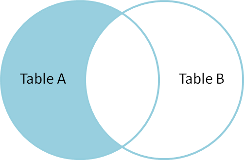

# SQL - Learning and Practice

This repository contains notes and queries with SQL. The purpose of this repository is to learn and practice PostgreSQL.

<!-- Table of contents -->
## Table of Contents


- [Cheat Sheet](#cheat-sheet)
- [SQL Statement Fundamentals](#sql-statement-fundamentals)
    * [SELECT](#select)
    * [COUNT](#count)
    * [SELECT WHERE](#select-where)
    * [ORDER BY](#order-by)
    * [LIMIT](#limit)
    * [BETWEEN](#between)
    * [IN](#in)
    * [LIKE AND ILIKE](#like-and-ilike)
- [GROUP BY - Statements](#group-by---statements)
    * [Aggregation Functions](#aggregation-functions)
    * [GROUP BY Function](#group-by-function)
    * [HAVING Function](#having-function)
- [JOINS](#joins)
    * [AS](#as)
    * [INNER JOIN](#inner-join)
    * [OUTER JOIN](#outer-join)
    * [FULL JOIN](#full-join)
    * [UNION](#union)


## Cheat Sheet


# SQL Statement Fundamentals

## SELECT

```sql
-- Select a column from table
SELECT column_name FROM table_name;

-- Select more columns from table
SELECT column_name1, column_name1 FROM table_name;

-- Select all columns from table
SELECT * FROM table_name;

-- Select Distinct - i.e.: only select the distinct values from a column
SELECT DISTINCT(column_name) FROM table_name;
```

## COUNT

```sql
-- Count rows in column
SELECT COUNT(column_name/choice/*) FROM table_name;

-- Count distinct
SELECT COUNT(DISTINCT column_name) FROM talbe_name;
```

## SELECT WHERE

```sql
SELECT column1, column2
FROM table_name
WHERE conditions;
```

| Operator | Description |
| --- | --- |
| = | Equal |
| > | Greater than |
| < | Less than |
| >= | Greater than or equal to |
| <= | Less than or equal to |
| <> or != | Not equal to |

**************************************Logical Operations:**************************************

- AND
- OR
- NOT

```sql
-- Example SELECT WHERE
SELECT title FROM film
WHERE rental_rate > 4 AND replacement_cost >= 19.99
AND rating = 'R';
```

## ORDER BY

```sql
-- Order by a column Ascending or Descending
SELECT column_1, column_2
FROM table_name
ORDER BY column_1 ASC/DESC;

-- More than one orderings
SELECT column_1, column_2
FROM table_name
ORDER BY column_1 DESC, column_2 ASC;
```

## LIMIT

```sql
-- LIMIT Statement limits the number of rows shown by the query - like top5
SELECT column_1, column_2
FROM table_name
ORDER BY column_1 ASC/DESC 
LIMIT 5;
```

## BETWEEN

```sql
-- Using Between for numerical values 
SELECT *
FROM table_name
WHERE amount BETWEEN 8 AND 9;

-- Using the between with NOT logical statement
SELECT *
FROM table_name
WHERE amount NOT BETWEEN 8 AND 9;

-- Using Between for data values
SELECT *
FROM table_name
WHERE amount BETWEEN '2010-02-1' AND '2010-02-15';
```

## IN

```sql
-- Example of NOT IN sting values
SELECT color_name
FROM table_name
WHERE color_name IN ('red','blue') 

-- Example of IN numerical values
SELECT COUNT(*)
FROM table_name
WHERE amount IN (0.99,1.98,1.99)
```

## LIKE AND ILIKE

```sql
-- First letter example with LIKE - ! Is case sensitive
SELECT COUNT(*)
FROM customer
WHERE first_name LIKE 'J%' AND last_name LIKE 'S%'

-- ILIKE - is case insensitive - doesn't matter if you are using captital letter
SELECT COUNT(*)
FROM customer
WHERE first_name ILIKE 'j%' AND last_name ILIKE 's%'

-- Other example
SELECT COUNT(*)
FROM customer
WHERE first_name ILIKE 'er%'
```

# GROUP BY - Statements

## Aggregation Functions

- The main idea behind an aggregate function is to take multiple inputs and return single output.
- Most common aggregate functions: AVG(), COUNT(), MAX(), MIN(), SUM()
- Extra tip: ROUND(AVG(col_name), num_decimal_places)

```sql
-- Example using aggregation Functions. E.g.: returns the Minimum cost.
-- Similarly for MAX, AVG -- This will return a single value!
SELECT MIN(cost) FROM table_name;
```

## GROUP BY Function

- GROUP BY allows us to aggregate columns per some category.
- We need one categorical column to perform the GROUP BY (can be also numerical as catecories,  e.g. category = 1 , 2 ,3 , etc.)
- Example: we can grouby and sum per category and see the total sum of every category.

```sql
-- Basic Syntax -- Where AGG = Aggregation Function (SUM, MIN, MAX,...)
SELECT category_col, AGG(data_col)
FROM table 
GROUP BY category_col
```

- The GROUP BY clause must apper right after a FROM or WHERE statement!

```sql
-- Example with sales:
SELECT company, division, SUM(sales)
FROM finance_table
GROUP BY company, division
```

- WHERE statements should not refer to the aggregation results, later on we will leran to use HAVING statement to filter on those results.

## HAVING Function

- Is coming after a GROUP BY call.

```sql
-- Basic Syntax
SELECT company, SUM(sales)
FROM finance_table
WHERE company != 'Google'
GROUP BY company
HAVING SUM(sales)>1000
```

# JOINS
- JOINS allows us to combine data from different tables
- AS next to column allows us to rename columns.
- Join types are INNER JOINS, OUTER JOINS, FULL JOINS, UNIONS

## AS

```sql
-- Example: rename column with AS
SELECT SUM(amount) AS sum_amount
FROM PAYMENT;
```

## INNER JOIN


- **An INNER JOIN will result with the set of records that match in both tables.**
- INNER JOIN is symmetrical

```sql
-- Basic Syntax
SELECT * FROM TableA
INNER JOIN TableB
ON TableA.col_match = TableB.col_match
```

## FULL OUTER JOINs

- There are few different types of OUTER JOINs
- They will allow us to specify how to deal with values only present in one of the tables being joined.

### FULL OUTER JOIN


1. The FULL OUTER JOIN grabs everything in both tables
2. If values from the one table are not present in the second then the table will have null values.

```sql
-- Basic Syntax
SELECT * FROM TableA
FULL OUTER JOIN TableB
ON TableA.col_match = TableB.col_match 
```

### FULL OUTER JOIN with WHERE


1. Grab all the unique rows from tables
2. This is the opposite of INNER JOIN

```sql
SELECT * FROM TableA
FULL OUTER JOIN TableB
ON TableA.col_match = TableB.col_match 
WHERE TableA.id IS null OR TableB.id IS NULL
```

## LEFT OUTER JOIN



- A LEFT OUTER JOIN results in the set of records that are in the left table, if there is no match with the right table, the results are null.
- It is the same using LEFT JOIN  and LEFT OUTER JOIN
- The order of tables MATTER!!!

```sql
-- Basic Syntax
SELECT * FROM TableA
LEFT OUTER JOIN TableB
ON TableA.col_match = TableB.col_match
```

### LEFT OUTER JOIN with WHERE



- If we want entries unique to table A. Those rows found in TableA and not found in TableB.

```sql
SELECT * FROM TableA
LEFT OUTER JOIN TableB
ON TableA.col_match = TableB.col_mathc
WHERE TableB.id IS NULL
```

## RIGHT JOINS

- A RIGHT JOIN is essentially the same as a LEFT JOIN, except the tables are switched.
- This would be the same as switching the table order in a LEFT OUTER JOIN.

## UNION

- The UNION operator is used combine the results-set of two or more SELECT statements.
- It basically serves to directly concatenate two results together, essentially “pasting” them together.

```sql
-- Basic Syntax -- Columns need to match in both tables.
SELECT column_name(s) FROM table1
UNION
SELECT column_name(s) FROM table2
```